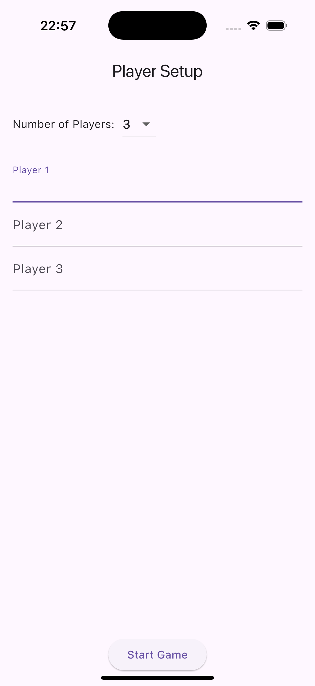
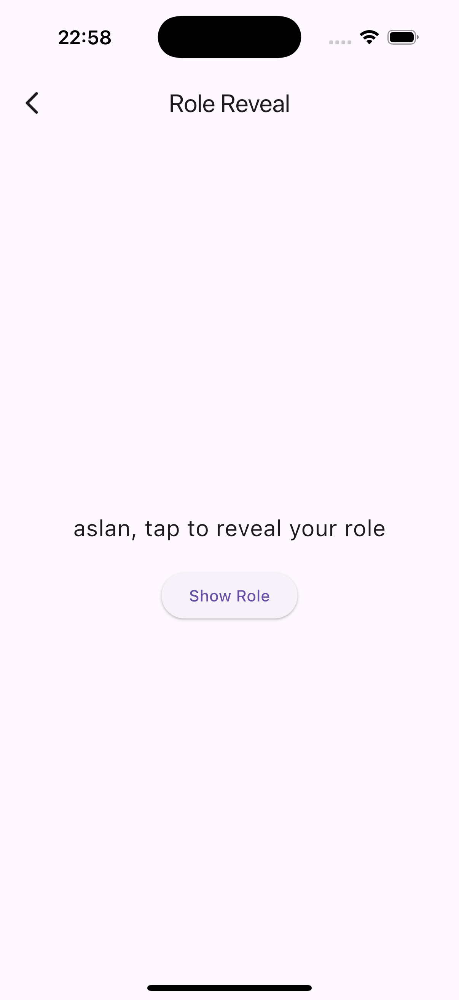
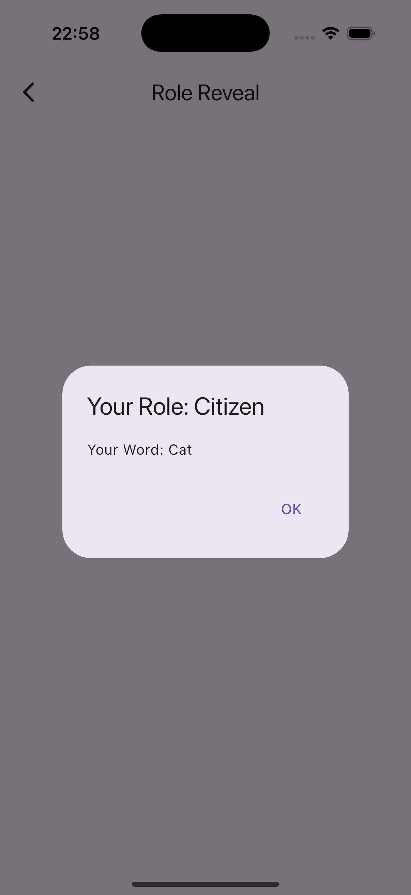

# Undercover Game Clone - Flutter

A simple Flutter party game clone based on the original Undercover Game.

## 🔧 Features
- Setup screen to enter number of players and names
- Role distribution (1 Undercover, rest Citizens)
- Word-pair system
- Private role display

## 🧪 How to Run

```bash
git clone https://github.com/yourusername/undercover_game_clone.git
cd undercover_game_clone
flutter pub get
flutter run


## Screenshots






